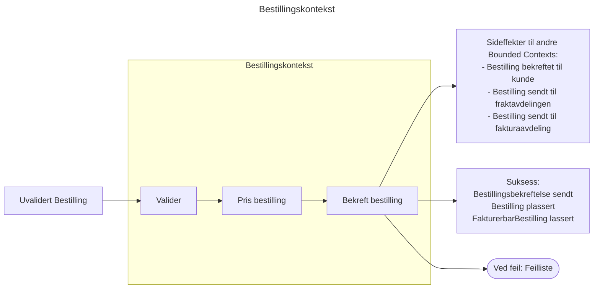

# 👓 Domene Dreven Design - med funksjonelle briller 👓 
Workshop for faggruppen *Arkitektur i Praksis*. Etter å ha deltatt i denne workshoppen vil du ha:

* Lært om DDD og fordelene med en slik tankegang og arkitektur.
* Oppdaget hvordan funksjonell programmering passer godt sammen med DDDs workflow-prinsipper.
* Fått prøve å kode på en måte som er både funksjonell og domene-drevet.

## 💡 Introduksjon
Vi har fått et spennende oppdrag fra ingen ringere enn Magnus Midtbø. Magnus har nemlig besluttet å åpne en nettbutikk som skal selge klatreutstyr og T-skjorter – alt designet for å inspirere til å klatre høyere og sikrere!

Etter å ha hørt noe snakk om Domene dreven design og viktigigheten av et produktteam, samler du sammen Magnus og gjengen og kjører en Event Storming.
Der kommer dere fram til en avgrenset kontekst (Bounded Context) som Magnus gjerne vil at du tar ansvar for. 
Spesifikt er dette Bestillingskonteksten som har ansvar for å ta imot en  bestilling og behandle denne. Dette blir dere enige om å kalle `PlasserBestillingWorkflow`. Magnus forteller at den består av følgende steg:

1. Ikke validerte bestillinger blir mottatt via Youtube-kommentarer på videoene til Magnus. Problemet er at kommentarene ofte inneholder mangelende eller feil data. Alle bestillinger må derfor nøye valideres.
2. Deretter skal bestillinges prises. Alle ordrelinjer skal prises og totalen skal beregnes. Selve prisingen ligger i et egen system (en annen Bounded Context), og vi kan bruke en ekstern tjeneste for å hente dette.-
3. Deretter skal bestillingen bekreftes per epost til brukeren, bestillingen skal sendes til frakavdelingen og fakturaavdelingen skal motta prisinformasjon.

"Topp!", - tenker du. Dette kan jeg jo modelere som en kontiunerlig workflow uten sideeffekter!  



## 📚 Ressurser
Workshoppen og oppgaven er inspirert av boken [Domain Modelling Made Functional](https://github.com/swlaschin/DomainModelingMadeFunctional). Deler av oppgaven er portet fra F# til Kotlin.

Deler av kodebase bruker Result-typen fra `kotlin-result`. Dokumentasjonen finnes [her](https://github.com/michaelbull/kotlin-result).

## 👩‍💻 Oppgaver

### Kom i gang
For å komme i gang med oppgaven, følg disse trinnene:

1. Klon ned kodebasen fra GitHub ved å kjøre følgende kommando i terminalen:
```bash
git clone https://github.com/Quist/funksjonell-ddd.git
```

2. Åpne prosjektet i IntelliJ
IntelliJ IDEA er en anbefalt editor for å jobbe med Kotlin og Gradle-prosjekter.
Last ned IntelliJ IDEA hvis du ikke allerede har det installert.
Åpne IntelliJ, og importer prosjektet som et eksisterende Gradle-prosjekt.

3. Du finner oppgavene lenger ned her. Lykke til!

### Oppgaver 📋
Magnus Midtpø kjenner ikke til Integers og Strings. Vi har derfor modellert ordreId som en egen type.

#### Oppgave 1 - Domenemodellering med typer

> Ved å modellere det på denne måten gjør vi det "umulig" å sende med en kundeId der det skulle være en ordreId og vica verca. Kompilatoren hjelper oss å holde styr på koden vår.

##### 1a Definere en enkel value type
Kjør enhetstesten. Den feiler fordi KundeId ikke er definert som en type. Definer den

##### 1b Forretningsprosesser modelert som workflows
Implementer/endre på en av de første workflowen.

##### Oppgave 2 - Integritet og konsistens i Domenet
> Målet er å lage en avgrenset kontekst (bounded context) der all data inne i domenet er gyldig og konsistent, til forskjell fra dataen fra den skumle utenfor verden.

> Hvis vi kan være sikker på at all data er gyldig i vår kontekst, kan implementasjonen være mye renere og vi kan unngå defansiv koding.

##### Oppgave 2a - Integritet 
Magnus har nevnt at enhetsmengde alltid skal være mellom 1 og 1000. Implementer en integritetssjekk som gjør det umulig at en ordre kan inneholde mer enn 1000 enheter. 

##### Oppgave 2b - Konsistens
Alle validerteBestillinger må ha minst en ordrelinje. Hvordan kan vi modellere domenet for å sørge for dette? Prøv å løs dette ved å endre på modellen (og konstruktører).

> Hint: Sjekk ut NonEmptyList typen som ligger under `utils/`

##### Oppgave 2x Implementere forretningsregler ved å bruke typesystemet.
TODO: Vurdere oppgave med hvordan modellere uverifiserte og verifiserte adresser. 


#### 💰Oppgave X -Videreutvikle designet 
I denne delen av workshoppen jobber vi videre med endringer i kravene fra Magnus.
Målet er å reflektere over hvordan endringer påvirker både domenemodellen og koden, og å se hvordan en domene-drevet tilnærming kan håndtere slike justeringer.

Det finnes ingen fasit her – det er opp til deg hvordan du velger å løse oppgavene, og poenget er å lære gjennom å eksperimentere og reflektere.Vi ser på 4 forskjellige typer endringer:
* Legge til et nytt steg i workflowen.
* Legge til input i workflowen.
* Endre definisjonen av en kjernetype og se hvordan det påvirker systemet.
* Endre hele arbeidsflyten til å stemme med forretningregler. 

#### Oppgave X_1 Legge til fraktkostnader
En sen søndagskveld legger du i vei til et lokalt klatresenter i Oslo. Når du kommer kommer inn får du øye på en kar i bar overkropp som filmer seg selv. Akkurat i det du innser at det er Magnus, så roper han på deg:
Det viser seg at det er store problemer med inntjeningen på nettsalget. Magnus sier at han helt har glemt å tenke på at det koster penger for frakt!

a: Legg til et steg for å legge til fraktkostader, f.eks etter prisOrdre-steget.
b: Inkluderer fraktkostnaden i bekreftelseseposten.

#### Oppgave X_2 Legge til støtte for VIP-kunder

#### Oppgave X_3 Legge til støtte for promokoder

#### Oppgave X_4 Implementere søndagsstengt

