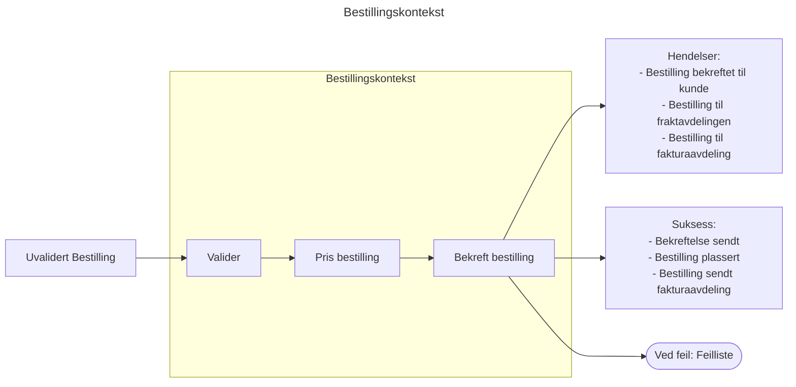

# 👓 Domene-drevet Design - med funksjonelle briller
Workshop for faggruppen *Arkitektur i Praksis*. Etter å ha deltatt i denne workshoppen vil du ha:

* Lært om domene-drevet design (DDD) og fordelene med en slik tankegang og arkitektur.
* Oppdaget hvordan funksjonell programmering passer godt sammen med DDD.
* Kodet både funksjonelt og domene-drevet i Kotlin.

## 💡 Introduksjon
Vi har fått et spennende oppdrag fra ingen ringere enn Magnus Midtbø. Magnus og vennene hans har nemlig besluttet å åpne en nettbutikk som skal selge klatreutstyr.
Han slenger rundt seg med uttrykk og fraser du aldri har hørt før: han skal selge Black Diamond "nøtter" og "kammer", kalk, cordeletter og du vet ikke hva.
Ettersom du nylig har hørt om **domene-dreven design** og viktigheten av tverrfaglige produktteam, samler du sammen Magnus og gjengen og kjører en **Event Storming**.

Dere kommer fram til en avgrenset kontekst (Bounded Context), **Bestillingskonteksten**, som Magnus gjerne vil at du tar ansvar for. 
Dere blir enige om å kalle `PlasserBestillingWorkflow`. Magnus forteller at den består av følgende steg:

1. **Ikke validerte bestillinger** blir mottatt via Youtube-kommentarer på videoene til Magnus. Problemet er at kommentarene ofte inneholder manglende eller feil data. Alle bestillinger må derfor nøye **valideres**.
2. Deretter skal bestillinges **prises**. Alle ordrelinjer skal prises og totalen skal beregnes. Selve prisingen ligger i et eget system utenfor vår kontekst, og vi kan bruke en ekstern tjeneste for å hente dette.
3. Deretter skal bestillingen **bekreftes** per e-post til brukeren, bestillingen skal sendes til **fraktavdelingen** og **fakturaavdelingen** skal informasjon om hva som skal prises.

"Topp!", - tenker du. Dette kan jeg jo modelere som en kontinuerlig workflow uten sideeffekter!  



## 📚 Ressurser
Workshoppen og oppgaven er inspirert av boken [Domain Modelling Made Functional](https://github.com/swlaschin/DomainModelingMadeFunctional). Deler av oppgaven er portet fra F# til Kotlin.

Deler av kodebase bruker Result-typen fra `kotlin-result`. Dokumentasjonen finnes [her](https://github.com/michaelbull/kotlin-result).


## 📋 Kom i gang
1. Klon ned kodebasen fra GitHub ved å kjøre følgende kommando i terminalen:
```bash
git clone https://github.com/Quist/funksjonell-ddd.git
```

2. Åpne prosjektet i IntelliJ.

IntelliJ IDEA er en anbefalt editor for å jobbe med Kotlin og Gradle-prosjekter.
Last ned IntelliJ IDEA hvis du ikke allerede har det installert.
Åpne IntelliJ, og importer prosjektet som et eksisterende Gradle-prosjekt.

3. Du finner oppgavene lenger ned her. Lykke til!

## 👩‍💻 Oppgaver
Det er skrevet JUnit tester for flere av oppgavene. Det kan være et lurt sted å starte for å få oversikt over oppgaven og validere løsningen. Se `Oppgaver.kt`. Implementasjonskoden er i `BestillingImpl.kt`

> [!NOTE]
> I DDD er en viktig del av designet å beskytte domenet og sørge for at det forretningslogiske laget forblir konsistent og robust. Validering av input hjelper med å forhindre at ugyldige eller uventede data når inn til kjerneobjektene og ødelegger forretningslogikken.

### Oppgave 1a
Magnus spør om du vil være ut å klatre. I det du sikrer Magnus og han er på vei opp i veggen, forteller han at han har fått noen sinte e-poster fra fraktavdelingen. De mottar masse bestillinger med ugyldige gateadresser.

```kotlin 
data class ValidertAdresse(val gateadresse: String, val postnummer: Number)
```

* **Endre `ValidertAdresse` slik at konstruktøren blir privat. Legg til en companion object med en create-metode som sørger for at gateadressefeltet ikke et tomt.**
* **Husk å få testen til å passere!**

### Oppgave 1b
I det Magnus klipper seg inn i første klipp, tar han opp et problem rundt postnummer. For Magnus og de andre er det ganske "selvsagt" at norske postnummer er tallverdier mellom 0001 og 9999. 

_"Ahh",_- tenker du inne i deg. Hvis det er sånn de snakker om det, så bør vi nok også modelere det sånn.

* **Innfør en ny type, `Postnummer`. Endre feltet postnummer i `ValidertAdresse` til å være av denne typen. `Postnummer` skal ha som invariant at postnummer er et tall mellom 0001 og 9999. Du kan kaste en `ugyldigAdresse`-exception om det ikke er det.**
* **Sjekk at testen passerer.**

### Oppgave 1c 
Magnus forsetter å prate mens han klatrer oppover. Han forteller om at selv om det formelt sett er _gyldige adresser_ som sendes inn, så hender det at adressen rett og slett ikke finnes!
Du feilsøker litt og ser fort at et teammedlemm fra et konkurrende konsulentselskap har lagt igjen en TODO i `tilValidertAdresse`funksjonen.

* **Oppdater `sjekkAdresseEksisterer` i `Dependencies.kt` med testadressen angitt i `eksempelGyldigBestilling`**. Sjekk at testen passerer.
* **Implementer en sjekk av at adressen faktisk finnes i `tilValidertAdresse`. Sjekk at testen passerer.**

> [!NOTE]
> Vi kan la være her, men her kunne vi også valgt å innføre en ny type for å både reflektere en gyldig og eksisterende adresse:
> ```data class ValidertOgEksisterendeNorskAdresse ..```

### Oppgave 2a
Etter å ha toppet ut ruta, firer Magnus seg ned mot bakken. På vei ned forteller han om et annet problem de har hatt: ugyldige e-poster som blir sendt inn i systemet.

* **Implementer validering av e-post som validerer er en alfakrøll i e-posten og den er lengre en 2 tegn.**

> [!TIP]
> Prøv å gjør endringen "typedrevet". Endre typen i `Kundeinfo` til å være en (ny) `ValidertEpost` value class.

### Oppgave 2b
I det Magnus setter foten på bakken igjen, hører du noen voldsomme skrik fra en langbeint klatrer i naboveggen. Magnus titter raskt bort, før han forteller videre om hvordan de ser for seg å modellere e-post.
Ikke bare er den _validert_ – en e-post skal verifiseres at den faktisk tilhører brukeren. 
Magnus foreslår derfor at dere endrer den delte mentale modellen for e-post til å være en slags union type alá `Epost = VerifisertEpost(epost: ValidertEpost) | UverifisertEpost()`

Hvis e-posten ikke er verifisert skal ordren fremdeles gå igjennom, men det skal ikke genereres en epost til brukeren.
```kotlin
data class KundeInfo(val kundeId: KundeId, val kundeEpost: Epost)
```
1. **Definer en ny type som fanger at en gyldig e-post kan være enten verifisert eller ikke verifisert. Du kan f.eks bruke et `sealed interface`.**
2. **Endre KundeInfo slik at `kundeEpost` er av den nye typen.**
3. **Ta i bruk den eksisterende `SjekkEpostVerifiseringsStatus` dependencien for å sjekke om eposten er verifisert eller ikke. Den bør sendes med fra hovedfunksjonen.**
4. **Implementer eventuelle nødvendige kodedringer.**
4. **Få testen til å passere.**

> [!TIP]
> Sjekk ut dokumentasjonen for Sealed Interface om du trenger hjelp 🧠
> 
> Det finnes en dependency Sjekke-postStatus som kan brukes. Husk at den bør sendes med i hovedfunksjonen.

### Oppgave 3
Den høylytte klatreren kommer bort. Det viser seg at han heter Adam Ondra og er endel av virksomheten til Magnus. Adam forteller om enda et problem. Det kommer mange bestillinger inn i systemet som ikke har noen ordrelinjer! Da blir det bare støy for faktura- og regnskapsavdelingen.

```kotlin
data class ValidertBestilling(
    ..
    val ordrelinjer: List<ValidertOrdrelinje>,
)

```

**Implementer en endring i domenetypene slik at listen aldri kan være tom.**
> [!TIP]
> Hint: Sjekk ut NonEmptyList typen som ligger under `utils/`. Konstruktøren i NonEmptyList returnerer et Result. Hva må du kjøre for å unwrappe resultatet?
> 

### Oppgave 4a
> [!TIP]
> I domene-drevet design (DDD) er _hendelser_ viktige konsepter som representerer noe som har skjedd i domenet. Hendelser brukes til å beskrive forretningsmessige tilstander eller endringer som er viktige for systemet å kjenne til. De formidler informasjon om endringer på en måte som kan brukes av andre deler av systemet eller eksterne systemer.

Adam Ondra har modellert hovedfunksjonen vår til å returnere en liste av _hendelser_. Han ber deg forsikre deg om at alt er som det skal ved å fullføre noen Junit-tester han har startet på.

* **Implementer en assert på at det returneres en hendelse av typen `BekreftelseSentTilBrukerHendelse`**.

### Oppgave 4b
Magnus forteller at han gir bort gratis postere av han selv i nettbutikken. Problemet er at fakturaavdelingen hans mottar masse faktuaer på kr 0,-. Dette skaper bare støy.

* **Endre på implementasjonen av `lagHendelser` slik at det kun genereres en FakturaHendelse om fakturasum er større en 0,-.** 

## 💰Oppgave 5 -  Videreutvikle designet 
I denne delen av workshoppen jobber vi videre med endringer i kravene fra Magnus. Det er ingen fasit – det er opp til deg hvordan du velger å løse oppgavene.
Du kan også velge hvilken av oppgavene du har lyst til å implementere.

Målet er å reflektere over hvordan endringer påvirker både domenemodellen og koden, og å se hvordan en domene-dreven tilnærming kan håndtere slike justeringer.

###  🚚 Oppgave 5a Legge til fraktkostnader
Det viser seg at det er store problemer med inntjeningen på nettsalget. Magnus sier at han helt har glemt å tenke på at det koster penger for frakt!
Her kan du f.eks differensiere fraktkostnadene på postnummer (Nord-Norge, Svalbard, røkla etc).

Momenter å vurdere:
* Hvor skal logikken legges? En mulighet er i prising-steget, men det kan potentsielt introdusere kompleksitet og bugs i kode som fungerer i dag.
* En annen mulighet er å legge det til som et eget steg. Da er det lettere å teste det i isolasjon og ansvaret for fraktkostnader kan ligge et sted.
* Hvordan modellere selve prissettingen slik at det er fleksibelt?

**Legg til logikk for å legge til fraktkostnader på en ordre. Spesifiser fraktkostnaded i eposten som blir bekreftet til bruker.**

> [!Note] 
> Å definere det som et selvstendig steg kan være nyttig for å tydeligjøre hva som skjer i foretningsprosessen. 

### 🌟Oppgave 5b Legge til støtte for VIP-kunder
Magnus vil gjerne at alle klatrevenne hans skal få gratisk frakt. Han vil gjerne kalle det VIP-kunder, og tenker at det kan komme flere fordeler etterhvert.

* Finn et måte å endre modellen til `KundeInfo` i `ValidertBestilling` til å representere VIP-kunder.
* Legg til et steg, eller endre et steg, for å implementere dette.


### 🤑Oppgave 5c Legge til støtte for promokoder
Etter en diskusjon med salgsteamet til Magnus kommer dere opp med følgende krav:

* Når man legger inn en bestilling, _kan_ kunden sende inn en promokode.
* Hvis koden er tilstede, så vil noen produkter gi andre priser.
* Bestillingen bør vise at en promokode var brukt.

> [!TIP]
> Tilsynelatede uskylding, vil den siste kravet påvirke store deler av domenet vårt. Lykke til!

### 🧗 Oppgave 5d Implementere søndagsstengt
Magnus jobber ikke søndager når det er godt klatrevær.

```kotlin
typealias PlasserBestillingWorkflow = (Bestilling) -> Result<List<PlasserBestillingHendelse>, Valideringsfeil | WorkLessClimbMore>
```

* **Implementer at systemet er helt søndagssteng**
* **Endre returtypen til hovedfunksjonen vår til å reflektere at funksjonen kan feile med `WorkLessClimbMore`**

## 🌟 Bonusoppgaver

### Bruk Result-typen istedenfor å kaste exceptions
Refaktorere kodebasen til å bruke Result-typen i stedet for å kaste exceptions. 

> [!TIP]
> **Hvorfor bruke result-typen?**
> 
> 
> Funksjonell feilhåndtering: Result gjør det tydelig hvordan feil skal håndteres, og tvinger kallere til å forholde seg til mulige feil, noe som reduserer risikoen for uventede programfeil.
>
> Bedre lesbarhet: Koden blir mer lesbar og forståelig ved at feilhåndtering er en del av metodesignaturen, og det er lett å se hvilke situasjoner som kan føre til feil.
> 
> Ingen skjulte kontrollflytendringer: Exceptions kan gjøre kontrollflyten uforutsigbar, mens Result gjør flyten eksplisitt og enklere å følge.